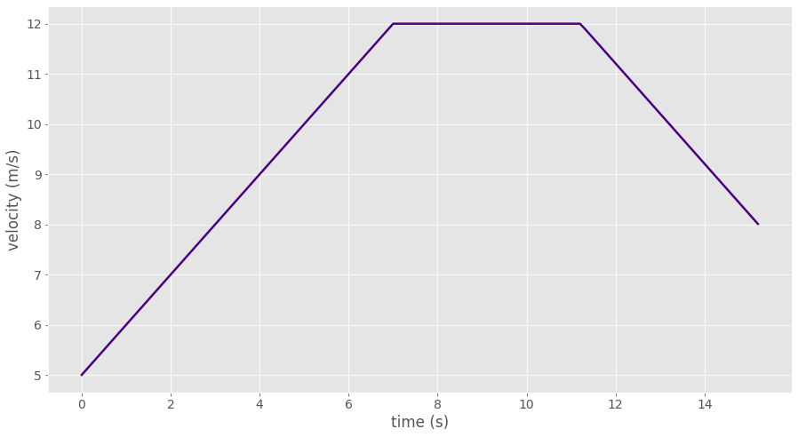
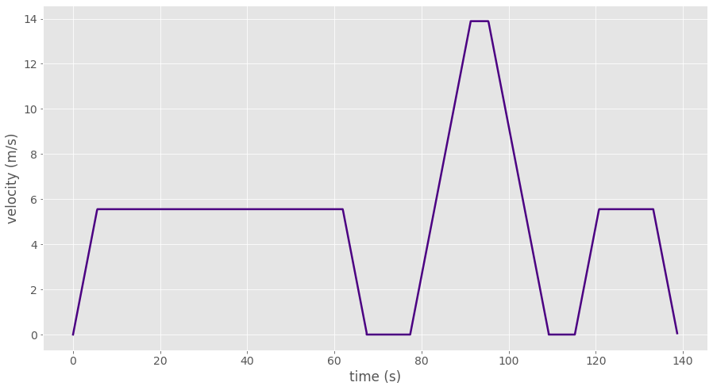
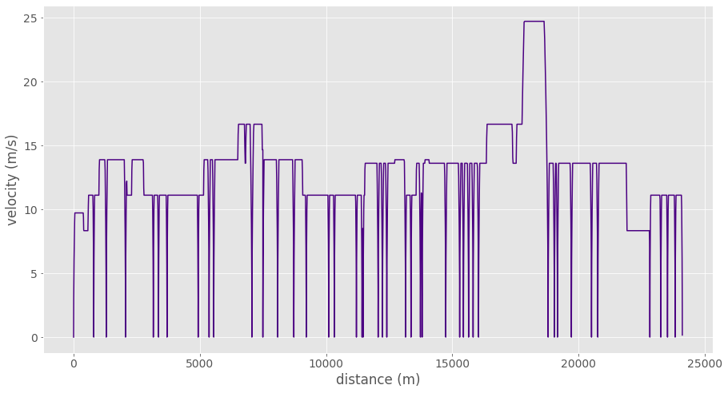
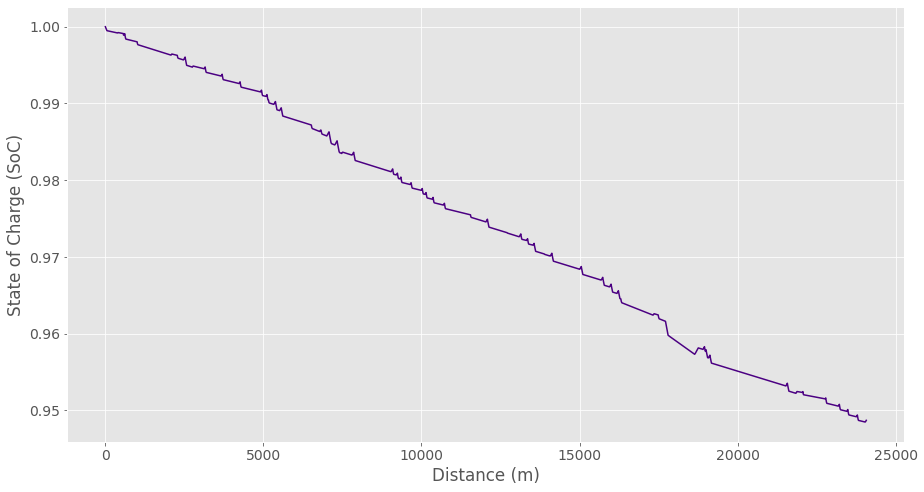

.. Drivecycle documentation master file, created by
   sphinx-quickstart on Fri Jan 14 14:22:09 2022.
   You can adapt this file completely to your liking, but it should at least
   contain the root `toctree` directive.

Drivecycle 0.1.0 Documentation
======================================

**Drivecycle** is a python package that simulates complex velocity-time profiles for electric vehicles while taking into account stop and intersection locations along with speed limits. 
Drivecycle also simulates battery state of charge (Soc) given vehicle (i.e. mass, battery capacity, etc.) 
and route (i.e. elevation change) characteristics.

Installation
------------

To use Drivecycle, first install it using pip:

.. code-block:: console

   (.venv) $ pip install -e .

Usage
------------

Plot Simple Tragectories
#########################

The trajectory function can be used to generate a trajectory given some contraints such as distance, 
acceleration and start/end/target velocities. This current release only models constant acceleration trajectories however other models may be added in future.

.. code-block:: python

   from drivecycle import route, trajectory, plots

   traj = trajectory.const_accel(vi=5, v_target=12, vf=8, df=150)
   
   plots.plot_vt(traj, "plot_vt.png")

Generate Drive Cycle
#####################

Trajectories are grouped together to form drive cycles of a given path. 
See sample drive cycle input path. The `drivecycle` function may include a `stops` parameter 
that constrains which nodes (i.e. street interseciton or stop locations) the vehicle must stop 
at and for how long. 

.. code-block:: python

   # What nodes should we stop at and for how long (seconds)
   stop={"bus_stop":30,"tertiary":10}

   # Generate route drive cycle
   route_drive_cycle = route.sequential(
      edges, 
      stops=stop, 
      stop_at_node=True, 
      step=0.1
      )

   plots.plot_vt(route_drive_cycle, "plot_vt.png")

Sample Path Input
##################

A path graph data structure is created using OpenStreetMap (OSM) taxonomy. 
`intersection` denotes the edge that intersects the end node and may be another OSM `way` 
or simply a stop location. For example `"intersection":["primary"]` indicates a primary road 
intersecting the end node. 

.. code-block:: python

   path = [
      {
         "way_id":1,
         "speed":20,
         "length":100,
         "intersection":["primary"]
      },
      {
         "way_id":2,
         "speed":20,
         "length":145,
         "intersection":["primary"]
      },
      {
         "speed":20,
         "length":100,
         "intersection":["bus_stop"]
      },
      {
         "way_id":3,
         "speed":50,
         "length":150,
         "intersection":["primary"]
      },
      {
         "way_id":4,
         "speed":50,
         "length":100,
         "intersection":["tertiary"]
      },
      {
         "way_id":5,
         "speed":20,
         "length":100,
         "intersection":["service","service"]
      }
   ]

Generate Path Graph
####################

Drive Cycle include utils that can used to generate graphs usting `networkx`. 
These are helpful to simplify path graphs to reduce redundant nodes and edges that may cause
trajectories to fail. It can also be used to embed stops in a given path graph. 

.. code-block:: python

   stops=[100,367] # linearly referenced stop locations along the route

   route_graph = graph.Graph(edges) # create instance of Graph class

   route_graph.include_stops(stops) # insert stop into the path graph

   # Cluster stop locations in the filter list that are close together
   route_graph.consolidate_intersections( 
      ["tertiary", "secondary", "bus_stop"]
      )

   # Merge adjacent edges that have the same speed but do not merge
   # stop locations in the filter list.
   route_graph.simplify_graph(
      ["tertiary", "secondary", "bus_stop"]
      )

   route_graph.get_edges()

Generate Drivecycle using Valhalla Trace Attributes
####################################################

Valhalla's map matching API can be used to match a route geometry to OSM way ids. 
This can help us determine both road speeds and intersection locations along a route. 
Using the map matching Trace Attributes action, we can get a list of OSM edges the route 
travels along:

.. code-block:: python

   [{'end_node': {'type': 'street_intersection',
      'elapsed_time': 0.698,
      'intersecting_edges': [{'road_class': 'service_other',
      'begin_heading': 204,
      'to_edge_name_consistency': False,
      'from_edge_name_consistency': False}]},
   'length': 0.007,
   'names': ['48 Avenue NW'],
   'speed': 35,
   'way_id': 463682703},
   {'end_node': {'type': 'street_intersection',
      'elapsed_time': 7.607,
      'intersecting_edges': [{'road_class': 'residential',
      'begin_heading': 131,
      'to_edge_name_consistency': False,
      'from_edge_name_consistency': False}]},
   'length': 0.067,
   'names': ['48 Avenue NW'],
   'speed': 35,
   'way_id': 463682703}
   .
   .
   .

Using the drivecycle apis listed above we can then generate a simulation drivecycle of 
the entire route:

Electric Vehicle Battery State of Charge (SoC)
###############################################

Using the drive we generated of the route, we can model the the battery state of charge (SoC)
of a battery electric vehicle using characteristics of the bus and batteries cells.

.. code-block:: python

   power = energy.energy_model(
      dc, # drivecycle
      m=15000, # mass in kg
      capacity=500, # battery capacity in kWh
   )

.. toctree::
   :maxdepth: 1

   drivecycle
   valhalla
   energy

